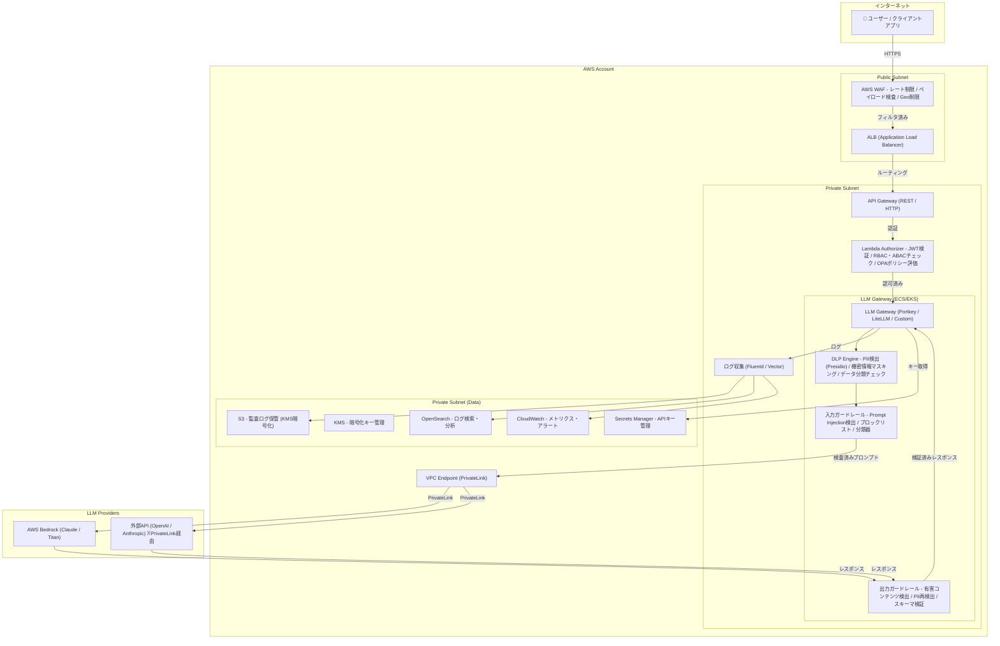
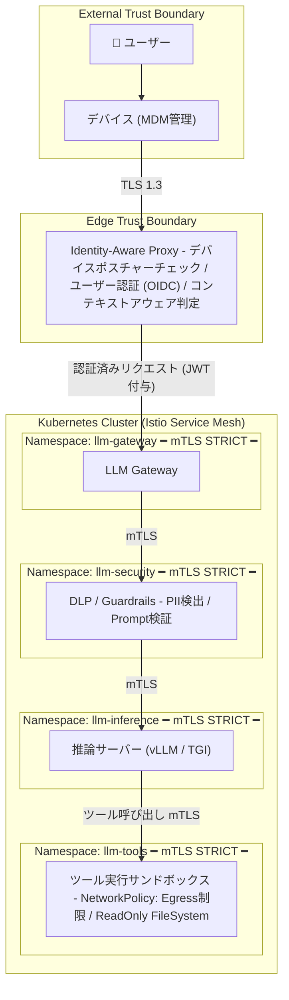
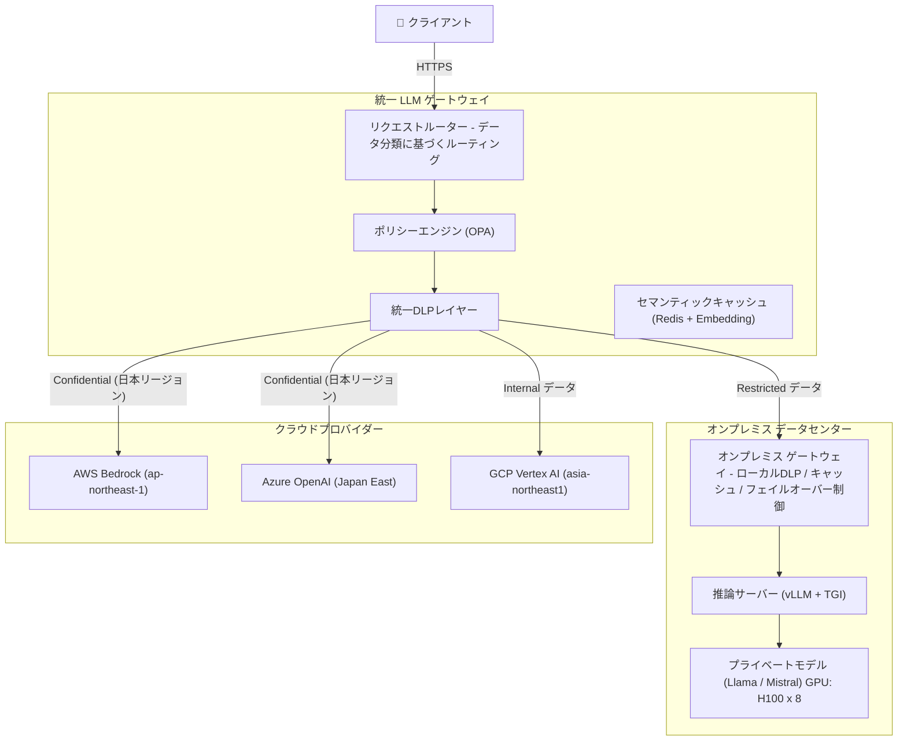
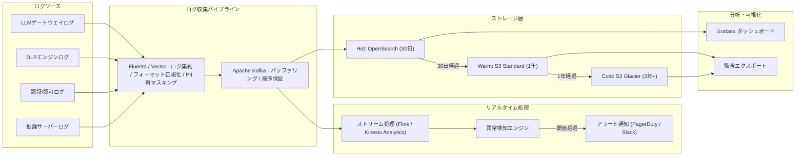
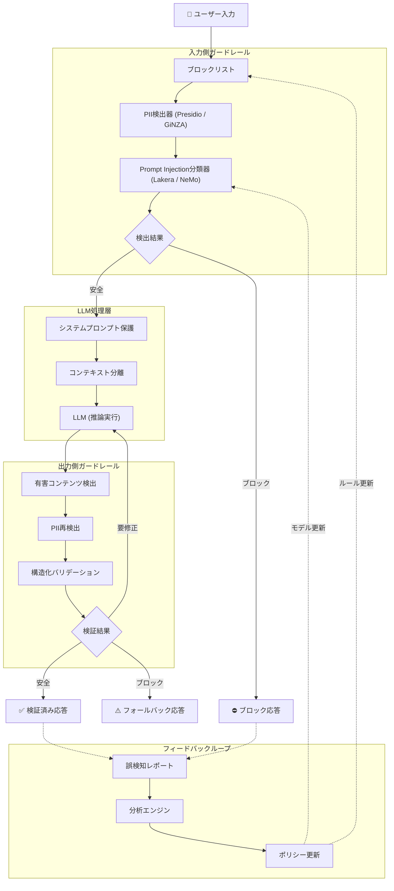

# 企業向けLLMインフラ セキュリティアーキテクチャ設計

**包括的調査レポート — API直接利用からプライベートホスティングまで、全3パターンにおけるセキュリティ設計の実践ガイド**

2026年2月 | 対象読者: インフラエンジニア・プラットフォームチーム・技術リーダー

---

## エグゼクティブサマリー

企業におけるLLM（大規模言語モデル）の導入が加速するなか、セキュリティアーキテクチャの設計は最も重要な技術課題の一つとなっている。本レポートでは、LLMインフラにおける6つのセキュリティ領域を網羅的に調査し、3つのアーキテクチャパターンそれぞれに対する具体的な設計指針を提示する。

LLMシステムは従来のWebアプリケーションとは異なるセキュリティ特性を持つ。自然言語インタフェースを介した攻撃（Prompt Injection）、学習データ経由の情報漏洩、非決定的な出力に対する検証の困難さなど、従来のセキュリティフレームワークだけでは対処できない固有のリスクが存在する。OWASP Top 10 for LLM Applications（2025）やMITRE ATLASが示すように、LLM特有の脅威モデルを理解したうえで、多層防御の設計が求められる。

> **本レポートが前提とする3つのアーキテクチャパターン**
>
> **パターンA**: API直接利用 — 小〜中規模チーム向け。OpenAI / Anthropic / Google等のAPIを直接呼び出す構成。
>
> **パターンB**: LLMゲートウェイ/プロキシ経由 — 中〜大規模組織向け。DLP・PII検出・RBACを統合した中間層を配置。
>
> **パターンC**: プライベート/オンプレミスホスティング — 規制業界向け。完全なデータ統制下でのモデルデプロイ。

---

## 目次

1. [データ保護・プライバシー](#1-データ保護プライバシー)
2. [アクセス制御・認証](#2-アクセス制御認証)
3. [ネットワークセキュリティ](#3-ネットワークセキュリティ)
4. [プロンプトセキュリティ](#4-プロンプトセキュリティ)
5. [コンプライアンス・監査](#5-コンプライアンス監査)
6. [サプライチェーン・モデルセキュリティ](#6-サプライチェーンモデルセキュリティ)
7. [インフラ構成図（A〜E）](#7-インフラ構成図)
8. [付録: 統合チェックリスト・参考資料](#付録-統合チェックリスト参考資料)

---

## 1. データ保護・プライバシー

### 1.1 課題と背景

LLMへのプロンプトには、意図的・非意図的に機密情報が含まれるリスクがある。Samsung社員がChatGPTにソースコードを入力したインシデント（2023年）は、LLM利用におけるデータ漏洩の代表的事例として広く知られる。また、LLMの出力にも学習データに含まれていた個人情報やAPIキーなどが再現されるリスクがある。従来のDLP（Data Loss Prevention）ソリューションはHTTPペイロードの定型パターンを検出対象としていたが、自然言語に埋め込まれた機密情報の検出には新たなアプローチが必要となる。

### 1.2 設計原則

- **最小情報原則**: LLMに送信するデータは必要最小限に留める。
- **多層検出**: 正規表現による高速パターンマッチとNER（Named Entity Recognition）モデルによる文脈理解を組み合わせる。
- **機密レベル連動**: データ分類ポリシーに基づき、機密度に応じてLLM利用を制限する。
- **検出と透明性のバランス**: 誤検知によるユーザー体験の低下を防ぎつつ、高リスクの漏洩は確実にブロックする。

### 1.3 具体的な実装手法

#### DLP（Data Loss Prevention）

| 手法                   | ツール/サービス                              | 特徴                                                                                                       | 適用フェーズ |
| ---------------------- | -------------------------------------------- | ---------------------------------------------------------------------------------------------------------- | ------------ |
| 正規表現パターンマッチ | カスタム実装 / AWS Macie                     | クレジットカード番号、マイナンバー、電話番号等の定型パターンを高速検出。低レイテンシだが文脈理解に限界あり | 入力/出力    |
| NERモデル              | Microsoft Presidio / spaCy / GiNZA（日本語） | 人名・組織名・住所等の非定型PIIを文脈から検出。日本語対応にはGiNZAやMeCab辞書との統合が効果的              | 入力/出力    |
| クラウドDLPサービス    | Google Cloud DLP / AWS Comprehend            | マネージドサービスとして150+の情報タイプを検出。API呼び出し型でスケーラブル                                | 入力/出力    |
| LLMゲートウェイ統合DLP | Portkey / LiteLLM / Guardrails AI            | LLMプロキシに組み込まれたDLP。プロンプト/レスポンスの中間で透過的に処理                                    | 入力/出力    |

#### PII検出・匿名化の実装アプローチ

リアルタイムPII検出の実装は、検出精度・レイテンシ・対応言語の3軸でアプローチを選定する。

```python
# Microsoft Presidio を用いたPII検出・匿名化の実装例
from presidio_analyzer import AnalyzerEngine, RecognizerRegistry
from presidio_anonymizer import AnonymizerEngine
from presidio_anonymizer.entities import OperatorConfig

# 日本語対応のためカスタムRecognizerを登録
registry = RecognizerRegistry()
registry.load_predefined_recognizers(languages=["en", "ja"])

analyzer = AnalyzerEngine(registry=registry)
anonymizer = AnonymizerEngine()

def sanitize_prompt(text: str) -> str:
    """プロンプト送信前のPII検出・マスキング"""
    results = analyzer.analyze(
        text=text,
        language="ja",
        entities=["PERSON", "PHONE_NUMBER", "EMAIL_ADDRESS",
                  "CREDIT_CARD", "JP_MY_NUMBER"]
    )
    anonymized = anonymizer.anonymize(
        text=text,
        analyzer_results=results,
        operators={
            "PERSON": OperatorConfig("replace", {"new_value": "[氏名]"}),
            "PHONE_NUMBER": OperatorConfig("mask", {"chars_to_mask": 8,
                                                      "masking_char": "*",
                                                      "from_end": False}),
            "DEFAULT": OperatorConfig("replace", {"new_value": "[REDACTED]"})
        }
    )
    return anonymized.text
```

#### データ分類ポリシー

| 分類レベル       | 定義         | LLM利用制限                           | 例                                       |
| ---------------- | ------------ | ------------------------------------- | ---------------------------------------- |
| **Public**       | 公開情報     | 制限なし（外部APIへの送信可）         | 公開ドキュメント、マーケティング資料     |
| **Internal**     | 社内限定情報 | 外部API利用可（DLPチェック必須）      | 社内Wiki、議事録                         |
| **Confidential** | 機密情報     | ゲートウェイ経由のみ（PII匿名化必須） | 顧客データ、契約書                       |
| **Restricted**   | 最高機密     | プライベートモデルのみ / LLM利用禁止  | 暗号鍵、医療データ、特許出願前の技術情報 |

### 1.4 パターン別の推奨構成

**パターンA（API直接利用）**: クライアントサイドでPresidio等を用いたPII検出を実装。CI/CDパイプラインにDLPスキャンを組み込み、APIキーやシークレットの送信を防止。ブラウザ拡張やCLIツールにプリプロセッサとして統合する方式が現実的。

**パターンB（ゲートウェイ経由）**: LLMゲートウェイ（Portkey / LiteLLM / カスタム実装）にDLPミドルウェアを配置。全リクエスト/レスポンスを透過的に検査。Google Cloud DLPやAWS ComprehendをAPI経由で呼び出し、検出結果に基づくマスキング・ブロックを実行。データ分類ポリシーとの連動により、Confidential以上のデータを含むリクエストを自動ブロック。

**パターンC（プライベートホスティング）**: データがネットワーク外に出ないためリスクは低減するが、内部者脅威への対策としてDLPは依然必要。推論サーバー前段にDLPプロキシを配置。出力側ではファインチューニングデータに含まれるPIIの再現を監視。全トラフィックのログを暗号化保存し、監査証跡を確保。

### ✓ データ保護・プライバシー チェックリスト

- [ ] プロンプト送信前のPII検出・マスキング機構が実装されている
- [ ] レスポンスに対する機密情報フィルタが実装されている
- [ ] データ分類ポリシーが定義され、分類レベルに応じたLLM利用制限が実装されている
- [ ] 日本語PIIの検出精度テストが実施されている（マイナンバー、氏名、住所等）
- [ ] DLP検出ルールの定期的な更新・チューニングのプロセスが確立されている
- [ ] 誤検知率（False Positive）の監視とフィードバックループが構築されている
- [ ] APIプロバイダーのデータ利用ポリシー（学習への使用有無）を確認・合意している
- [ ] DLPログが監査要件を満たす形で保持されている

---

## 2. アクセス制御・認証

### 2.1 課題と背景

LLMへのアクセスは「誰が」「どのモデルに」「どのような操作を」行えるかの精緻な制御が必要である。単一のAPIキーを複数チームで共有する運用は、監査追跡の困難さと不正利用時の影響範囲拡大を招く。また、LLMのツール利用（Function Calling / MCP）における権限昇格のリスクは新たな攻撃面となっている。

### 2.2 設計原則

- **最小権限の原則**: ユーザー・サービスアカウントに対し、必要最小限のモデル・機能へのアクセスのみを付与する。
- **認証の一元化**: 企業IdP（Identity Provider）との統合により、既存のID管理基盤を活用する。
- **短命クレデンシャル**: 長期APIキーではなく、有効期限付きトークンと自動ローテーションを基本とする。
- **ゼロトラスト**: すべてのリクエストを検証し、暗黙の信頼を排除する。

### 2.3 具体的な実装手法

#### RBAC / ABACの設計

| ロール          | 許可モデル            | 機能制限                     | レート制限  |
| --------------- | --------------------- | ---------------------------- | ----------- |
| developer       | GPT-4o, Claude Sonnet | テキスト生成、コード補完     | 100 req/min |
| analyst         | GPT-4o, Gemini Pro    | テキスト生成、RAG検索        | 50 req/min  |
| admin           | 全モデル              | 全機能 + ツール利用          | 200 req/min |
| service-account | 指定モデルのみ        | バッチ処理、パイプライン統合 | 500 req/min |

ABAC（Attribute-Based Access Control）を組み合わせることで、より柔軟な制御が可能となる。属性の例: 部署（engineering / legal / hr）、データ分類レベル（public / confidential）、リクエスト元ネットワーク（VPN / オフィス / 外部）、時間帯。

```rego
# OPA (Open Policy Agent) によるABACポリシー例 (Rego)
package llm.authz

default allow = false

allow {
    input.user.role == "developer"
    input.model in {"gpt-4o", "claude-sonnet-4-5"}
    input.data_classification in {"public", "internal"}
    input.source_network == "vpn"
}

allow {
    input.user.role == "admin"
    input.source_network in {"vpn", "office"}
}

# ツール利用（Function Calling）の制限
allow_tool_use {
    input.user.role == "admin"
    input.tool_name in allowed_tools[input.user.department]
}

allowed_tools["engineering"] = {"code_interpreter", "file_search"}
allowed_tools["legal"] = {"document_search"}
```

#### API鍵管理

| 要件               | 実装方法                                                                                                 | ツール                                                                    |
| ------------------ | -------------------------------------------------------------------------------------------------------- | ------------------------------------------------------------------------- |
| 安全な保管         | 暗号化されたシークレットストアに格納。環境変数や設定ファイルへの直書きを禁止                             | HashiCorp Vault, AWS Secrets Manager, Azure Key Vault, GCP Secret Manager |
| 自動ローテーション | 30〜90日周期でのキーローテーション。Vaultのdynamic secretsまたはSecretsManagerのローテーション機能を利用 | Vault Dynamic Secrets, AWS Lambda + Secrets Manager Rotation              |
| アクセス監査       | シークレットへのアクセスログを記録し、異常なアクセスパターンを検出                                       | Vault Audit Log, CloudTrail                                               |
| スコープ制限       | APIキーにサービスアカウント・IPレンジ・利用制限を紐付け                                                  | プロバイダーAPI設定 + ゲートウェイポリシー                                |

```bash
# HashiCorp Vault を用いたLLM APIキー管理例
# シークレットの格納
vault kv put secret/llm/openai api_key="sk-..." org_id="org-..."
```

```hcl
# 自動ローテーション用のポリシー
path "secret/data/llm/*" {
  capabilities = ["read"]
}
```

```yaml
# Kubernetes連携 (Vault Agent Injector)
# Pod起動時にVaultからシークレットを自動注入
apiVersion: apps/v1
kind: Deployment
metadata:
  name: llm-gateway
spec:
  template:
    metadata:
      annotations:
        vault.hashicorp.com/agent-inject: "true"
        vault.hashicorp.com/agent-inject-secret-openai: "secret/data/llm/openai"
        vault.hashicorp.com/role: "llm-gateway"
```

#### SSO / IdP統合

LLMプラットフォームへのユーザー認証は、企業のIdPと統合することで一元管理を実現する。OIDC（OpenID Connect）フローを推奨する。ユーザーはIdP（Okta / Azure AD / Google Workspace等）で認証後、JWTトークンを取得し、LLMゲートウェイがトークンを検証してアクセスを制御する。SAMLはレガシーシステムとの統合時に選択する。

#### mTLS（相互TLS認証）

サービスメッシュ（Istio / Linkerd）を用いて、LLM通信経路上のすべてのサービス間通信にmTLSを適用する。これにより、ネットワーク内の中間者攻撃を防止し、サービスの真正性を保証する。

```yaml
# Istio PeerAuthentication によるmTLS強制
apiVersion: security.istio.io/v1
kind: PeerAuthentication
metadata:
  name: llm-namespace-mtls
  namespace: llm-platform
spec:
  mtls:
    mode: STRICT # STRICT = mTLS必須、通信相手の証明書なしでは接続拒否
```

### 2.4 パターン別の推奨構成

**パターンA（API直接利用）**: Secrets Manager + 環境変数注入によるAPIキー管理。チームごとに個別のAPIキーを発行し、利用量の追跡と制限を実施。OPA SidecarまたはアプリケーションレベルでのRBACチェック。

**パターンB（ゲートウェイ経由）**: ゲートウェイでOIDC/SAMLトークンを検証し、ユーザー属性に基づくABACを実行。OPA / Cedar等のポリシーエンジンとの統合。バックエンドAPIキーはゲートウェイのみが保持し、ユーザーには短命トークンのみを発行。

**パターンC（プライベートホスティング）**: Kubernetes RBAC + Istio AuthorizationPolicy による多層アクセス制御。証明書ベース認証（mTLS）を推論エンドポイントまで徹底。内部PKI（Private CA）の運用。物理アクセス制御との連携。

### ✓ アクセス制御・認証 チェックリスト

- [ ] モデル・機能単位のRBAC/ABACポリシーが定義・実装されている
- [ ] 全APIキーがシークレットストアで管理され、自動ローテーションが有効である
- [ ] APIキーのハードコーディング検出がCI/CDに組み込まれている（gitleaks / truffleHog等）
- [ ] 企業IdPとのSSO統合が完了し、LLMアクセスが一元管理されている
- [ ] サービス間通信にmTLSが適用されている
- [ ] ツール利用（Function Calling / MCP）に対する個別の認可ポリシーが定義されている
- [ ] 定期的なアクセス権レビュー（棚卸し）のプロセスが確立されている

---

## 3. ネットワークセキュリティ

### 3.1 課題と背景

LLM APIへの通信は機密性の高いプロンプトとレスポンスを含むため、通信経路のセキュリティが極めて重要である。パブリックインターネット経由のAPI呼び出しは盗聴リスクがあり、TLS暗号化だけでは不十分な場合がある（TLS終端の問題、中間者攻撃のリスク等）。さらに、LLMのエージェント機能（ツール利用、外部API呼び出し）が普及するにつれ、Egress（外向き通信）の制御が新たな課題となっている。

### 3.2 設計原則

- **プライベート接続の優先**: 可能な限りパブリックインターネットを経由しない接続経路を選択する。
- **多層防御**: ネットワーク層、トランスポート層、アプリケーション層の各レベルでセキュリティ制御を実装する。
- **ゼロトラスト**: ネットワーク位置に基づく暗黙の信頼を排除し、すべてのアクセスを検証する。
- **最小通信原則**: 必要な通信のみを許可し、不要なEgressを遮断する。

### 3.3 具体的な実装手法

#### VPC / Private Linkによるプライベート接続

| クラウド | サービス                   | LLM対応                             | 構成概要                                                                                                            |
| -------- | -------------------------- | ----------------------------------- | ------------------------------------------------------------------------------------------------------------------- |
| AWS      | PrivateLink + VPC Endpoint | Bedrock (VPC Endpoint対応)          | VPCエンドポイントを作成し、Bedrockへの通信をAWSバックボーンネットワーク内に閉じる。DNS解決をプライベートDNSで処理。 |
| Azure    | Private Endpoint           | Azure OpenAI (Private Endpoint対応) | Private Endpointを作成し、Azure OpenAIリソースへのプライベートIP経由アクセスを確立。パブリックアクセスを無効化。    |
| GCP      | Private Service Connect    | Vertex AI (VPC-SC対応)              | Private Service Connectエンドポイントを作成。VPC Service Controlsにより、データの持ち出しも制御。                   |

```hcl
# AWS PrivateLink + Bedrock VPC Endpoint (Terraform)
resource "aws_vpc_endpoint" "bedrock" {
  vpc_id              = aws_vpc.main.id
  service_name        = "com.amazonaws.ap-northeast-1.bedrock-runtime"
  vpc_endpoint_type   = "Interface"
  subnet_ids          = aws_subnet.private[*].id
  security_group_ids  = [aws_security_group.bedrock_endpoint.id]
  private_dns_enabled = true  # プライベートDNSで名前解決

  tags = { Name = "bedrock-vpc-endpoint" }
}

resource "aws_security_group" "bedrock_endpoint" {
  vpc_id = aws_vpc.main.id
  ingress {
    from_port       = 443
    to_port         = 443
    protocol        = "tcp"
    security_groups = [aws_security_group.llm_gateway.id]  # ゲートウェイからのみ許可
  }
}
```

#### WAF / API Gatewayの構成

| 制御                 | 実装                                            | 目的                                 |
| -------------------- | ----------------------------------------------- | ------------------------------------ |
| レート制限           | API Gateway throttling (ユーザー/APIキー単位)   | DoS攻撃防御、コスト制御              |
| ペイロードサイズ制限 | API Gateway: max 10MB、WAFルールでbody size検査 | 大量データ送信によるリソース枯渇防止 |
| IPフィルタリング     | WAF IP Sets / Security Group                    | 許可IPレンジからのアクセスのみ許可   |
| 地理的制限           | WAF Geo-match                                   | 特定リージョンからのアクセスブロック |
| 異常検知             | AWS WAF Bot Control / カスタムルール            | 異常なリクエストパターンの検出       |

#### ゼロトラストアーキテクチャ

LLM通信経路にゼロトラストを適用する場合、信頼境界はリクエストの「各ホップ」に設定する。BeyondCorp / ZTNA（Zero Trust Network Access）の考え方に基づき、ネットワーク位置に依存せず、すべてのアクセスにおいて認証・認可・暗号化を要求する。

具体的には、Identity-Aware Proxy（Google IAP / Azure AD Application Proxy / Cloudflare Access）をLLMゲートウェイの前段に配置し、ユーザー認証とデバイスポスチャーチェックを行ったうえで、ゲートウェイへのアクセスを許可する構成が推奨される。

#### Egress制御

LLMエージェントがツールを利用する際の外部通信は、ホワイトリスト方式で制御する。

```yaml
# Kubernetes NetworkPolicy によるLLMポッドのEgress制御
apiVersion: networking.k8s.io/v1
kind: NetworkPolicy
metadata:
  name: llm-agent-egress
  namespace: llm-platform
spec:
  podSelector:
    matchLabels:
      app: llm-agent
  policyTypes:
    - Egress
  egress:
    # 許可: LLM API (PrivateLink経由)
    - to:
        - ipBlock:
            cidr: 10.0.100.0/24 # VPC Endpointのサブネット
      ports:
        - port: 443
          protocol: TCP
    # 許可: 社内APIのみ
    - to:
        - namespaceSelector:
            matchLabels:
              name: internal-apis
      ports:
        - port: 443
          protocol: TCP
    # DNS
    - to: []
      ports:
        - port: 53
          protocol: UDP
```

### 3.4 パターン別の推奨構成

**パターンA（API直接利用）**: TLS 1.3必須。可能であればPrivate Link利用。クライアント側でのCA証明書ピンニング検討。Egress制御はファイアウォール/プロキシで許可ドメインをホワイトリスト化。

**パターンB（ゲートウェイ経由）**: WAF → API Gateway → Lambda Authorizer → LLM Gatewayの多層構成。Private Link経由でLLM APIに接続。ゲートウェイのPublic Subnetへの配置を避け、Private Subnet + NLBで構成。

**パターンC（プライベートホスティング）**: 完全にVPC内で完結する構成。推論サーバーはPrivate Subnetに配置し、外部通信を一切遮断。サービスメッシュ（Istio STRICT mTLS）で全サービス間通信を暗号化・認証。

### ✓ ネットワークセキュリティ チェックリスト

- [ ] LLM APIへの接続がPrivate Link / Private Endpoint経由で構成されている
- [ ] TLS 1.3が全通信経路で適用されている
- [ ] WAF / API Gatewayによるレート制限・ペイロード検査が有効化されている
- [ ] ゼロトラスト原則に基づき、全リクエストの認証・認可が実装されている
- [ ] LLMエージェントのEgress通信がホワイトリストで制限されている
- [ ] ネットワークフローログが取得・監視されている
- [ ] マイクロセグメンテーションにより、LLMコンポーネント間の不要な通信が遮断されている

---

## 4. プロンプトセキュリティ

### 4.1 課題と背景

Prompt Injectionは、LLMアプリケーション固有の攻撃ベクトルであり、OWASP Top 10 for LLM Applications（2025）において最上位にランクされている。直接的インジェクション（ユーザーがプロンプトに攻撃コードを直接入力）と間接的インジェクション（外部データソースに仕込まれた攻撃コードをLLMが処理）の2種類があり、後者はRAGやツール利用の普及に伴い特に深刻な脅威となっている。

> **⚠️ 実際のインシデント例**
>
> 間接的Prompt Injectionにより、LLMチャットボットがユーザーの個人情報を攻撃者のサーバーに送信する事例が報告されている。Webページやメール本文に埋め込まれた不可視の指示文が、RAGを通じてLLMに読み込まれ、意図しない動作を引き起こすパターンが主流である。

### 4.2 設計原則

- **多層防御**: 入力側・処理層・出力側の各レベルでガードレールを実装する。
- **信頼境界の明確化**: システムプロンプト（信頼）とユーザー入力（非信頼）を明確に分離する。
- **最小権限**: LLMに与えるツール・データアクセスを必要最小限に制限する。
- **検出と緩和の併用**: 完全な防御は困難であるため、検出・ログ記録・アラートによる早期発見と緩和策を組み合わせる。

### 4.3 具体的な実装手法

#### Prompt Injection対策

| 対策層         | 手法                                                             | ツール/実装                                                                           |
| -------------- | ---------------------------------------------------------------- | ------------------------------------------------------------------------------------- |
| 入力検証       | パターンマッチによる攻撃シグネチャの検出                         | ブロックリスト（"ignore previous instructions", "system prompt"等）、正規表現フィルタ |
| 入力分類       | ML分類器による攻撃プロンプトの検出                               | Rebuff、Lakera Guard、NVIDIA NeMo Guardrails、Protect AI Guardian                     |
| プロンプト設計 | システムプロンプトでの防御指示、デリミタによるユーザー入力の分離 | XML/JSONタグによるコンテキスト分離、防御プロンプトの埋め込み                          |
| サンドボックス | LLMの出力を直接実行せず、構造化された出力のみを処理              | 出力をJSONスキーマで制約、Function Callingの結果を検証後に実行                        |
| アーキテクチャ | 信頼レベルの異なるコンテンツの分離処理                           | 外部コンテンツを別のLLM呼び出しで要約後、メインLLMに渡す「二重処理」パターン          |

#### Output Validation

LLMの出力には以下のリスクがある。PIIの漏洩（学習データまたはコンテキストからの再現）、有害コンテンツの生成、システムプロンプトの露出、コードインジェクション（出力がそのままHTML/SQLとして処理される場合）。

```python
# 出力バリデーションパイプラインの概念実装
from guardrails import Guard
from guardrails.hub import DetectPII, ToxicLanguage, RestrictToTopic

guard = Guard().use_many(
    DetectPII(
        pii_entities=["EMAIL_ADDRESS", "PHONE_NUMBER", "PERSON",
                      "CREDIT_CARD", "JP_MY_NUMBER"],
        on_fail="fix"  # 検出時にマスキング
    ),
    ToxicLanguage(
        threshold=0.8,
        on_fail="reask"  # 有害コンテンツ検出時にLLMに再生成を依頼
    ),
    RestrictToTopic(
        valid_topics=["技術サポート", "製品情報"],
        invalid_topics=["政治", "宗教", "競合他社の批判"],
        on_fail="filter"
    )
)

# ガード付きLLM呼び出し
result = guard(
    model="gpt-4o",
    messages=[{"role": "user", "content": user_input}]
)
```

#### ガードレール実装: 多層防御設計

| 層             | コンポーネント                                | 目的                          | ブロック時の挙動                             |
| -------------- | --------------------------------------------- | ----------------------------- | -------------------------------------------- |
| 入力側         | Prompt分類器 / ブロックリスト / PII検出       | 攻撃プロンプトの検出・PII除去 | ユーザーにエラーメッセージを返却。ログに記録 |
| 処理層         | システムプロンプト保護 / コンテキスト分離     | インジェクション耐性の向上    | LLMが防御プロンプトに従い安全な応答を生成    |
| 出力側         | 有害コンテンツ検出 / PII再検出 / スキーマ検証 | 不適切出力のフィルタリング    | マスキング / 再生成 / フォールバック応答     |
| フィードバック | 誤検知/見逃しの報告 → ポリシー更新            | 検出精度の継続的改善          | モデル再学習 / ルール更新                    |

#### Red Teaming / Adversarial Testing

| テスト手法                  | ツール                               | 対象                                       |
| --------------------------- | ------------------------------------ | ------------------------------------------ |
| 自動Prompt Injection テスト | Garak (NVIDIA), PyRIT (Microsoft)    | 既知の攻撃パターンの網羅的テスト           |
| Jailbreak耐性テスト         | HarmBench, JailbreakBench            | 安全フィルタの回避可能性を評価             |
| 情報漏洩テスト              | カスタムスクリプト + LLMプロービング | システムプロンプト・学習データの抽出可能性 |
| ツール悪用テスト            | 手動テスト + 自動化スクリプト        | Function Calling / MCPを経由した権限昇格   |

```bash
# Garak (NVIDIA) を用いた自動Prompt Injectionテスト
garak --model_type openai \
      --model_name gpt-4o \
      --probes promptinject,dan,encoding \
      --generations 10 \
      --report_prefix llm_security_audit
```

### 4.4 パターン別の推奨構成

**パターンA（API直接利用）**: アプリケーションコード内でGuardrails AI / NeMo Guardrailsを統合。入出力バリデーションをミドルウェアとして実装。定期的なGarakによる自動テストをCI/CDに組み込む。

**パターンB（ゲートウェイ経由）**: ゲートウェイに入出力ガードレールを一元的に配置。Lakera Guard / Protect AI等の専用サービスをインラインで統合。集中ログによる攻撃パターン分析と検出ルールの自動更新。

**パターンC（プライベートホスティング）**: 推論サーバー前段にガードレールプロキシを配置。NeMo Guardrailsをモデルサーバーと同一クラスタにデプロイ。モデル自体のファインチューニングによる安全性向上（RLHF/DPO）との組み合わせ。

### ✓ プロンプトセキュリティ チェックリスト

- [ ] 入力側ガードレール（分類器 + ブロックリスト + PII検出）が実装されている
- [ ] 出力側ガードレール（有害コンテンツ検出 + PII再検出 + スキーマ検証）が実装されている
- [ ] システムプロンプトとユーザー入力がデリミタで明確に分離されている
- [ ] 間接的Prompt Injection対策（外部コンテンツの分離処理）が実装されている
- [ ] ツール利用（Function Calling / MCP）の結果が検証後に実行されている
- [ ] Garak / PyRIT等による定期的なレッドチームテストが実施されている
- [ ] 攻撃検出のログとアラートが適切に設定されている
- [ ] フィードバックループによる検出精度の継続的改善が運用されている

---

## 5. コンプライアンス・監査

### 5.1 課題と背景

LLMの利用は多くの規制要件に影響を及ぼす。EU AI Act（2024年発効）によるリスクベースの規制、GDPRにおけるAIによるデータ処理の適法性、日本の個人情報保護法における要配慮個人情報の取り扱い、金融業界のFISC安全対策基準、医療分野の3省2ガイドライン等、業界・地域に応じた多様な規制への対応が求められる。さらに、LLMの出力は非決定的であるため、「何を入力し、何が出力されたか」の完全な監査証跡の確保が不可欠である。

### 5.2 設計原則

- **完全な監査証跡**: すべてのLLMインタラクション（プロンプト・レスポンス・メタデータ）を記録する。
- **最小保持原則**: 規制要件を満たす最小限の期間でログを保持し、不要になったデータは確実に削除する。
- **検索可能性**: 監査要求に対し、迅速にログを検索・提出できる基盤を構築する。
- **自動エンフォースメント**: ポリシー違反を手動監視ではなく、自動検出・ブロックする仕組みを構築する。

### 5.3 具体的な実装手法

#### 監査ログ設計

LLMの監査ログは、従来のアプリケーションログと比較してデータ量が大きい（1リクエストあたり数KB〜数百KB）。コストとのトレードオフを考慮した設計が重要である。

| ログレベル              | 記録内容                                                                       | 保持期間                  | ストレージ                     | コスト感 |
| ----------------------- | ------------------------------------------------------------------------------ | ------------------------- | ------------------------------ | -------- |
| **Level 1: メタデータ** | タイムスタンプ、ユーザーID、モデル名、トークン数、レイテンシ、ステータスコード | 3年                       | 構造化DB (DynamoDB / BigQuery) | 低       |
| **Level 2: ハッシュ**   | Level 1 + プロンプト/レスポンスのSHA-256ハッシュ                               | 1年                       | 構造化DB                       | 低       |
| **Level 3: 全文**       | Level 1 + プロンプト/レスポンスの全文（暗号化）                                | 90日〜1年（規制に応じて） | S3 (暗号化) / BigQuery         | 高       |

```json
// 監査ログのスキーマ例
{
  "timestamp": "2026-02-10T09:30:00Z",
  "request_id": "req_abc123",
  "user_id": "user@company.com",
  "user_role": "developer",
  "model": "claude-sonnet-4-5",
  "provider": "anthropic",
  "action": "chat.completions",
  "input_tokens": 1500,
  "output_tokens": 800,
  "latency_ms": 2340,
  "status": "success",
  "data_classification": "internal",
  "dlp_findings": [],
  "prompt_hash": "sha256:a1b2c3...",
  "response_hash": "sha256:d4e5f6...",
  "source_ip": "10.0.1.50",
  "tools_used": ["code_interpreter"],
  "guardrail_triggers": []
}
```

#### 規制対応マトリクス

| 規制                 | 主な要件                                       | LLMへの影響                                                            | 対応策                                                                            |
| -------------------- | ---------------------------------------------- | ---------------------------------------------------------------------- | --------------------------------------------------------------------------------- |
| **GDPR**             | データ主体の権利（アクセス権、削除権、説明権） | プロンプトに含まれる個人データの処理根拠、出力の説明可能性             | PII匿名化 / 利用目的の明示 / DPA締結 / 自動意思決定への同意取得                   |
| **個人情報保護法**   | 要配慮個人情報の取扱い、越境移転規制           | LLM APIへの要配慮個人情報の送信制限、海外APIプロバイダーへのデータ移転 | データ分類によるLLM利用制限 / 越境移転に関する同意取得 / 国内リージョンの利用     |
| **FISC安全対策基準** | 金融機関のIT利用に関する安全対策               | 外部クラウドサービスの利用基準、データ保管場所の制約                   | パターンC（プライベートホスティング）の採用 / データレジデンシーの確保 / 定期監査 |
| **3省2ガイドライン** | 医療情報の適切な管理                           | 患者データのLLM処理に関する制約                                        | 匿名化の徹底 / 国内データセンター利用 / アクセスログの長期保持                    |
| **HIPAA**            | Protected Health Information (PHI) の保護      | PHIをLLMに送信する際の制約                                             | BAA締結 / PHIの暗号化 / 監査ログの6年保持                                         |

#### データレジデンシー

| プロバイダー         | 日本リージョン対応                         | データ処理の保証                                                               |
| -------------------- | ------------------------------------------ | ------------------------------------------------------------------------------ |
| AWS Bedrock          | 東京リージョン (ap-northeast-1) で利用可能 | リクエスト/レスポンスはリージョン内で処理。学習には使用しない                  |
| Azure OpenAI         | Japan East で利用可能                      | データはデプロイしたリージョン内で処理。Abuse Monitoringは無効化可能（申請制） |
| GCP Vertex AI        | asia-northeast1 で利用可能                 | VPC-SC + データロケーションポリシーで制御                                      |
| OpenAI API (直接)    | リージョン指定不可                         | Zero Data Retention (ZDR) ポリシーあり。Enterprise契約で追加保証               |
| Anthropic API (直接) | リージョン指定不可（AWS/GCP経由で対応可）  | Commercial Terms: 入出力データを学習に使用しない                               |

#### 利用ポリシーのエンフォースメント自動化

```yaml
# OPA + Gatekeeper によるLLM利用ポリシーの自動エンフォース例
apiVersion: constraints.gatekeeper.sh/v1beta1
kind: LLMUsagePolicy
metadata:
  name: restrict-confidential-data
spec:
  match:
    kinds:
      - apiGroups: ["llm.company.com"]
        kinds: ["LLMRequest"]
  parameters:
    blockedClassifications: ["restricted"]
    requiredDLPCheck: true
    maxTokensPerRequest: 8000
    allowedModels:
      - "claude-sonnet-4-5"
      - "gpt-4o"
    requiredApprovals:
      confidential: ["team-lead"]
      restricted: ["ciso"]
```

### 5.4 パターン別の推奨構成

**パターンA（API直接利用）**: アプリケーション側でLevel 1 + Level 2ログを記録。CloudWatch Logs / Cloud Loggingに集約。APIプロバイダーのデータ利用ポリシーとDPA/BAA締結を確認。

**パターンB（ゲートウェイ経由）**: ゲートウェイでLevel 3（全文）ログを一元取得。S3 + KMS暗号化で保管し、OpenSearch/Elasticsearchで検索可能にする。リアルタイム異常検知パイプラインと連携。ポリシーエンフォースメントをゲートウェイで自動化。

**パターンC（プライベートホスティング）**: 全ログをオンプレミスに保管。外部への持ち出しを禁止。WORM（Write Once Read Many）ストレージで改ざん防止。監査証跡の完全性を暗号学的に保証（ハッシュチェーン）。

### ✓ コンプライアンス・監査 チェックリスト

- [ ] 全LLMリクエスト/レスポンスの監査ログが取得・保管されている
- [ ] ログのストレージ暗号化（at rest / in transit）が実装されている
- [ ] ログの保持期間が規制要件に基づいて設定されている
- [ ] 監査ログの検索・エクスポート機能が実装されている
- [ ] 対象規制（GDPR / 個人情報保護法 / 業界固有規制）への対応状況が文書化されている
- [ ] APIプロバイダーとのDPA/BAA等の契約が締結されている
- [ ] データレジデンシー要件を満たすリージョン構成が確認されている
- [ ] 利用ポリシー違反の自動検出・ブロック機構が実装されている
- [ ] リアルタイム異常検知とアラート通知が稼働している

---

## 6. サプライチェーン・モデルセキュリティ

### 6.1 課題と背景

LLMサプライチェーンは、モデルプロバイダー・ホスティング基盤・サードパーティプラグイン/ツール・ファインチューニングデータセットなど、複数の信頼関係に依存する。OWASP Top 10 for LLM Applications（2025）では「Supply Chain Vulnerabilities」がトップ10に含まれており、Hugging Face上のマルウェア入りモデルの発見や、悪意のあるMCPサーバーを通じた攻撃の報告など、LLMサプライチェーンのリスクは現実の脅威となっている。

### 6.2 設計原則

- **信頼の検証**: すべてのサプライチェーンコンポーネントの信頼性を検証し、暗黙の信頼を排除する。
- **完全性の保証**: モデルファイル・設定・依存関係の改ざんを検出する仕組みを構築する。
- **最小権限**: サードパーティプラグインやツールに対し、必要最小限の権限のみを付与する。
- **継続的評価**: モデルアップデートやツール変更時にセキュリティ回帰テストを実施する。

### 6.3 具体的な実装手法

#### モデルプロバイダーの信頼性評価チェックリスト

| 評価カテゴリ       | 確認項目                                     | 推奨基準                                                  |
| ------------------ | -------------------------------------------- | --------------------------------------------------------- |
| セキュリティ認証   | SOC 2 Type II、ISO 27001、CSA STAR           | SOC 2 Type II + ISO 27001の両方を保持                     |
| データ処理         | 入出力データの学習利用有無、保持期間、暗号化 | 学習不使用の明示的保証、AES-256暗号化、30日以内の自動削除 |
| データレジデンシー | 処理リージョンの選択可能性、データ移転の制御 | 日本リージョン対応、越境移転の明示的同意メカニズム        |
| インシデント対応   | 通知SLA、インシデントレスポンスプロセス      | 72時間以内の通知、専任セキュリティチームの存在            |
| 契約・法的         | DPA / BAA / 利用規約のレビュー               | 責任範囲の明確化、補償条項、準拠法                        |
| 可用性             | SLA、障害時のフォールバック                  | 99.9%以上のSLA、マルチリージョン対応                      |

#### プライベートデプロイ時のモデル整合性

```bash
# モデルファイルの整合性検証パイプライン
#!/bin/bash
# 1. モデルダウンロード時のチェックサム検証
MODEL_URL="https://huggingface.co/org/model/resolve/main/model.safetensors"
EXPECTED_SHA256="a1b2c3d4e5f6..."

wget -O model.safetensors "$MODEL_URL"
ACTUAL_SHA256=$(sha256sum model.safetensors | awk '{print $1}')

if [ "$ACTUAL_SHA256" != "$EXPECTED_SHA256" ]; then
    echo "ERROR: Model integrity check failed!"
    exit 1
fi

# 2. Sigstore/Cosign によるモデル署名検証
cosign verify-blob \
  --signature model.safetensors.sig \
  --certificate model.safetensors.cert \
  model.safetensors

# 3. SBOM (Software Bill of Materials) の生成
python generate_model_sbom.py \
  --model-path ./model.safetensors \
  --output model-sbom.spdx.json \
  --format spdx
```

> **⚠️ safetensorsフォーマットの推奨**
>
> Hugging FaceのモデルファイルにはPickle形式（.bin / .pt）とsafetensors形式がある。Pickle形式は任意のPythonコード実行が可能であり、悪意のあるモデルファイルによるRCE（Remote Code Execution）のリスクがある。safetensors形式はテンソルデータのみを格納し、コード実行のリスクがないため、プライベートデプロイでは必ずsafetensorsを使用すること。

#### サードパーティプラグイン/ツール/MCPサーバーのリスク評価

| 評価項目         | リスク: 低                                           | リスク: 中               | リスク: 高                   |
| ---------------- | ---------------------------------------------------- | ------------------------ | ---------------------------- |
| ソースコード     | OSS、監査済み                                        | OSS、未監査              | クローズドソース             |
| 権限要求         | 読み取りのみ                                         | 特定リソースへの書き込み | 広範な書き込み / 実行権限    |
| ネットワーク通信 | 通信なし（ローカル処理のみ）                         | 既知のAPIへの制限的通信  | 任意のエンドポイントへの通信 |
| データアクセス   | 公開データのみ                                       | 社内データの読み取り     | 機密データの読み書き         |
| メンテナンス     | 活発なメンテナンス、定期的なセキュリティアップデート | 定期的なアップデート     | メンテナンス不明 / 放置      |

```yaml
# MCPサーバーのセキュリティ評価自動化 (CI/CDパイプライン)
mcp_security_check:
  steps:
    - name: Static Analysis
      run: |
        # 依存関係の脆弱性スキャン
        npm audit --json > audit-report.json
        # または
        pip-audit --format json -o audit-report.json

    - name: Permission Analysis
      run: |
        python analyze_mcp_permissions.py \
          --manifest mcp-server/manifest.json \
          --policy company-mcp-policy.yaml

    - name: Network Analysis
      run: |
        python analyze_network_calls.py \
          --source mcp-server/ \
          --allowed-domains allowed-domains.txt

    - name: Sandbox Test
      run: |
        docker run --network=none --read-only \
          mcp-server-test:latest
```

#### モデルアップデート時のセキュリティ回帰テスト

モデルのバージョンアップ時には、以下のテストスイートを実行する。安全性ベンチマーク（既知の攻撃パターンに対する耐性）、出力品質の維持確認（ゴールデンテストセット）、PII漏洩テスト、Prompt Injection耐性テスト、ツール利用の安全性テスト。これらをCI/CDパイプラインに組み込み、テスト不合格時はデプロイをブロックする。

### 6.4 パターン別の推奨構成

**パターンA（API直接利用）**: プロバイダーの認証・ポリシーの定期レビュー。サードパーティツール/プラグインの利用承認プロセスの確立。APIバージョン固定とアップデート時のテスト。

**パターンB（ゲートウェイ経由）**: ゲートウェイでのプロバイダー切り替え対応（マルチプロバイダー戦略）。プラグイン/MCPサーバーのサンドボックス実行。ゲートウェイレベルでのモデルバージョン管理とカナリアデプロイ。

**パターンC（プライベートホスティング）**: モデルファイルのチェックサム・署名検証を必須化。SBOMの生成・管理。エアギャップ環境でのモデルデプロイパイプライン。依存ライブラリの定期的な脆弱性スキャン。

### ✓ サプライチェーン・モデルセキュリティ チェックリスト

- [ ] モデルプロバイダーの信頼性評価が実施・文書化されている
- [ ] プロバイダーとのDPA / BAA / セキュリティ条項が締結されている
- [ ] モデルファイルの整合性検証（チェックサム / 署名）が実装されている
- [ ] safetensors形式が使用されている（Pickleモデルの使用を禁止）
- [ ] SBOM（Software Bill of Materials）が生成・管理されている
- [ ] サードパーティプラグイン / MCPサーバーのリスク評価プロセスが確立されている
- [ ] プラグインのサンドボックス実行環境が構築されている
- [ ] モデルアップデート時のセキュリティ回帰テストがCI/CDに組み込まれている
- [ ] マルチプロバイダー戦略（プロバイダー障害時のフォールバック）が検討されている

---

## 7. インフラ構成図

### 構成図A: クラウドネイティブ LLMセキュリティアーキテクチャ（AWS基準）

VPC設計、セキュリティレイヤーの配置、データフロー上の各チェックポイントを示す。全トラフィックがPrivate Subnet内のLLMゲートウェイを経由し、PrivateLink経由でBedrock / 外部APIに接続する構成。



### 構成図B: ゼロトラスト LLMネットワーク構成

信頼境界をリクエストの各ホップに設定し、Identity-Aware Proxy、サービスメッシュ（Istio/Envoy）によるmTLS通信、マイクロセグメンテーションを適用した構成。



### 構成図C: マルチクラウド/ハイブリッド構成

オンプレミスのプライベートモデルとクラウドの商用APIを併用する構成。統一ゲートウェイによるルーティングとポリシー適用、データレジデンシー制御、フェイルオーバーを実現。



**ルーティングロジック**: データ分類レベルに基づき、Restrictedデータはオンプレミスのプライベートモデルのみに送信。Confidentialデータは日本リージョンのクラウドAPI（Bedrock / Azure OpenAI）に限定。Internalデータは最適なプロバイダーにコスト・レイテンシを考慮してルーティング。プライマリプロバイダーの障害時は、ポリシーを維持したままセカンダリプロバイダーにフェイルオーバー。

### 構成図D: 監査・コンプライアンス基盤

ログ収集パイプライン、リアルタイム異常検知、監査証跡の保持と検索、コンプライアンスダッシュボードの全体構成。



### 構成図E: プロンプトセキュリティ多層防御

入力側ガードレール、LLM処理層のセキュリティ、出力側ガードレール、およびフィードバックループの全体構成。



---

## 付録: 統合チェックリスト・参考資料

### 全領域 統合セキュリティチェックリスト

導入フェーズ（初期構築 / 運用安定期 / 成熟期）に応じて優先度を判断する。

| 領域                   | 項目                                   | 初期構築 | 運用安定期 | 成熟期 |
| ---------------------- | -------------------------------------- | -------- | ---------- | ------ |
| データ保護             | PII検出・マスキングの実装              | ◎ 必須   | ◎          | ◎      |
| データ保護             | データ分類ポリシーの策定と適用         | ◎ 必須   | ◎          | ◎      |
| データ保護             | DLPの継続的チューニング                | ○ 推奨   | ◎ 必須     | ◎      |
| アクセス制御           | RBAC/ABACの実装                        | ◎ 必須   | ◎          | ◎      |
| アクセス制御           | APIキーの自動ローテーション            | ○ 推奨   | ◎ 必須     | ◎      |
| アクセス制御           | SSO/IdP統合                            | ○ 推奨   | ◎ 必須     | ◎      |
| ネットワーク           | TLS 1.3の全通信適用                    | ◎ 必須   | ◎          | ◎      |
| ネットワーク           | Private Link / VPC Endpoint            | ○ 推奨   | ◎ 必須     | ◎      |
| ネットワーク           | ゼロトラスト（IAP + mTLS）             | △ 検討   | ○ 推奨     | ◎ 必須 |
| プロンプトセキュリティ | 入出力ガードレール                     | ◎ 必須   | ◎          | ◎      |
| プロンプトセキュリティ | Prompt Injection分類器                 | ○ 推奨   | ◎ 必須     | ◎      |
| プロンプトセキュリティ | 定期的なレッドチームテスト             | △ 検討   | ○ 推奨     | ◎ 必須 |
| コンプライアンス       | 監査ログの取得・保管                   | ◎ 必須   | ◎          | ◎      |
| コンプライアンス       | 規制対応の文書化                       | ◎ 必須   | ◎          | ◎      |
| コンプライアンス       | リアルタイム異常検知                   | △ 検討   | ○ 推奨     | ◎ 必須 |
| サプライチェーン       | プロバイダー信頼性評価                 | ◎ 必須   | ◎          | ◎      |
| サプライチェーン       | モデル整合性検証                       | ○ 推奨   | ◎ 必須     | ◎      |
| サプライチェーン       | MCPサーバー/プラグインのサンドボックス | △ 検討   | ○ 推奨     | ◎ 必須 |

◎ 必須 = 対応必須 | ○ 推奨 = 対応を強く推奨 | △ 検討 = リスク評価に基づき検討

### パターン選定ガイド

| 判断基準      | パターンA         | パターンB               | パターンC                  |
| ------------- | ----------------- | ----------------------- | -------------------------- |
| 組織規模      | 〜50名            | 50〜5,000名             | 規模問わず（規制要件駆動） |
| 月間LLMコスト | 〜$5,000          | $5,000〜$100,000        | $100,000+（GPU含む）       |
| データ機密度  | Public / Internal | Internal / Confidential | Confidential / Restricted  |
| 規制要件      | 低（一般IT企業）  | 中（個人情報保護法）    | 高（金融 / 医療 / 防衛）   |
| 運用チーム    | 兼任1-2名         | 専任2-5名               | 専任5名以上                |
| 導入期間      | 1-2週間           | 1-3ヶ月                 | 3-12ヶ月                   |
| 初期投資      | 低                | 中                      | 高                         |

### 参考資料・情報源

| 資料名                                         | 発行元                   | 概要                                                                    |
| ---------------------------------------------- | ------------------------ | ----------------------------------------------------------------------- |
| OWASP Top 10 for LLM Applications (2025)       | OWASP                    | LLMアプリケーション固有の主要脅威トップ10                               |
| NIST AI Risk Management Framework (AI RMF 1.0) | NIST                     | AIシステムのリスク管理フレームワーク（Govern / Map / Measure / Manage） |
| MITRE ATLAS                                    | MITRE                    | AIシステムに対する敵対的脅威のナレッジベース                            |
| CSA AI Safety Initiative                       | Cloud Security Alliance  | クラウドにおけるAI安全性のガイダンス                                    |
| AWS Bedrock Security Best Practices            | AWS                      | Bedrockのセキュリティ構成ガイド                                         |
| Azure OpenAI Security Baseline                 | Microsoft                | Azure OpenAIの安全なデプロイガイド                                      |
| GCP Vertex AI Security Overview                | Google Cloud             | Vertex AIのセキュリティアーキテクチャ                                   |
| EU AI Act                                      | European Parliament      | AI規制法（リスクベースのカテゴリ分類）                                  |
| FISC安全対策基準                               | 金融情報システムセンター | 金融機関のIT利用に関する安全対策基準                                    |
| 3省2ガイドライン                               | 厚労省/経産省/総務省     | 医療情報システムのセキュリティガイドライン                              |

---

_本レポートは2026年2月時点の情報に基づいて作成されています。LLMのセキュリティランドスケープは急速に変化しており、定期的な見直しを推奨します。_
